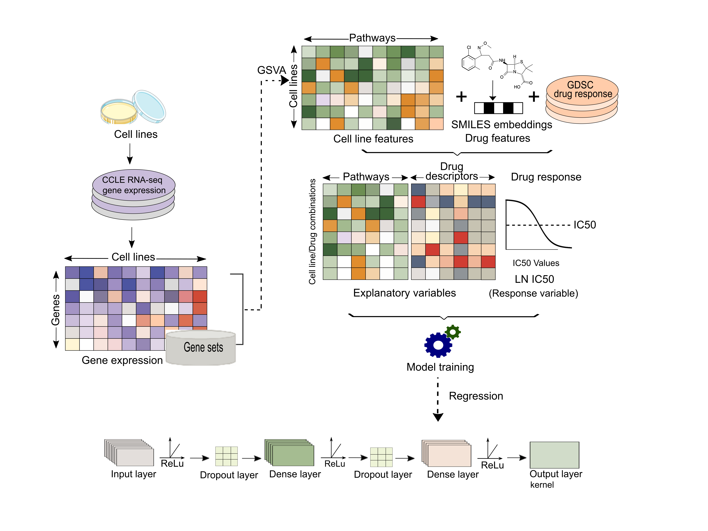

# Precily

Precily, Deep neural network based framework for prediction of drug response in both in vivo and in vitro settings.

Title: Gene expression based inference of cancer drug sensitivity

This resource provides code to reproduce key results in the manuscript.
Getting started

1. Download Github repository

   git clone https://github.com/SmritiChawla/Precily.git

2. Packages required

   Packages: keras 2.8.0, keras-tuner 1.1.0, caret(v6.0.90), glmnet(v4.1.3), ranger(v0.13.1), GSVA(v1.40.1), h2o(v3.36.0.4), PubChemPy(v1.0.4), SMILESVec,   EDASeq(v2.26.1), impute(v1.66.0), ggpubr(v0.4.0), ggplot2(v3.3.5), pheatmap(v1.0.12), parsnip(v0.2.1), ggridges(v0.5.3).
   

3. Use R script EnvSet.R provided in the directory EnvironmentSetup to setup environment in R for loading python trained deep neural network models.

4. Run individual codes from the figure wise directories for reproducing manuscript results.

Description

Data folder contains processed CCLE/GDSC and CCLE/CTRPv2 datasets used for machine learning tasks. 

1. Fig1: This folder contains codes used for evaluating CCLE/GDSC data trained model and contains following subdirectories:
Fig1c: Codes for reproducing different approaches used for benchmarking Precily. Individual codes are provided to run the respective methods. Also codes to assess performance of individual methods are provided based on pretrained models. For Random Forest, pre-trained pathway and gene based models are provided in the link [https://drive.google.com/drive/folders/1BbSNS_DXSaLgXt8MVeoySdr0uB-81xKJ?usp=sharing].
Fig1d. CCLE/GDSC2 data trained models and test dataset used for evaluation of Precily based deep neural network model.
Fig1e. CCLE/CTRPv2 data trained models and test dataset used for evaluation of Precily based deep neural network model.
2.  Fig2: This folder contains codes used for evaluating CCLE/GDSC data trained model on scRNA-seq datasets and contains following subdirectories:
Fig2a: This folder contains CCLE/GDSC dataset trained models, processed Kinker, G. S. et al. scRNA-seq dataset and ground truth labels for evaluation of Precily.
Fig2b: This folder contains code for assessing the efficiency of our model on Lee et al scRNA-seq profiles of MDA-MB-231 breast cancer cells. DrugsPred.R function is used for making predictions. This function takes 3 files as input: enrichment scores computed used GSVA method, metadata file containing information about cell lines and drugs along with molecular descriptors and Cancer type for the input test dataset. For Lee et al we have specified BRCA as a cancer type.
3. Fig3: This directory contains codes for evaluation of Precily on prostate cancer cell line dataset. The GSVA scores for untreated prostate cancer cell line and treated LNCaP cell lines are provided for drug response prediction using PRAD as a cancer type. 
4. Fig4: This directory contains codes for reproducing results for LNCaP derived xenografts datasets. We have included predictions for 155 drugs for 54 samples and GSVA scores.
5. Fig5. This directory contains codes for evaluation of model trained on TCGA patient RNA-seq bulk profiles.
Fig5a folder contains script and data used for training AutoML models.
Fig5b folder contains predictions obtained on TCGA test dataset using best AutoML model and code for computing survival on these predictions.
Fig5d-f folder contains codes for evaluating our model using external Wagle, Nikhil, et al. dataset. For drug response prediction we have used SKCM as a cancer type.
6. Supplementary directory contains codes for reproducing supplementary figures and some additional codes used for analyses.
